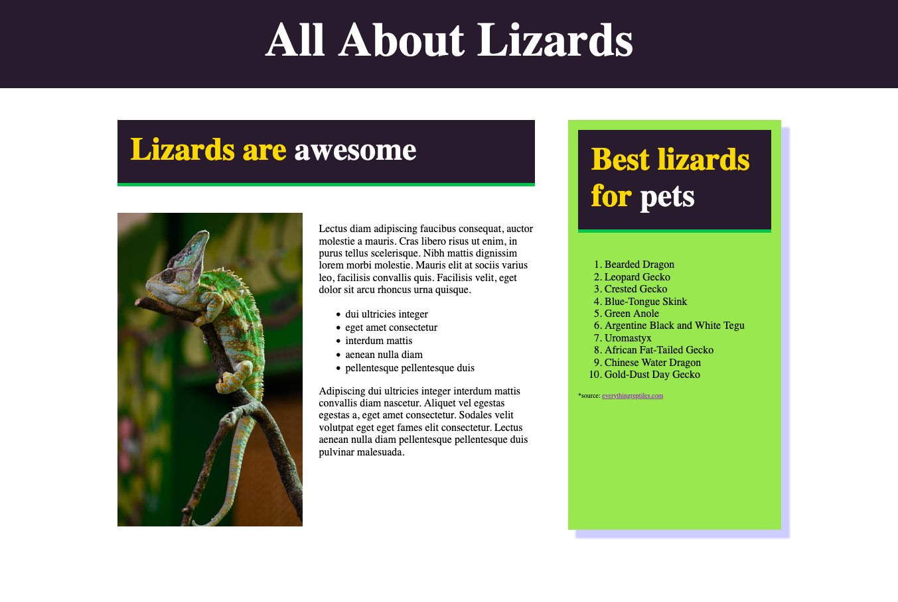

# Scrimba Frontend Career Path - Module 02

This is a solution to the [Scrimba Frontend Career Path - Module 02 - Challenges](https://scrimba.com/learn/frontend/bonus-challenge-cvwy6ET6). Frontend 

## Table of contents

- [Overview](#overview)
  - [The challenge](#the-challenge)
  - [Screenshot](#screenshot)
  - [Links](#links)
- [My process](#my-process)
  - [Built with](#built-with)
  - [What I learned](#what-i-learned)
  - [Continued development](#continued-development)
  - [Useful resources](#useful-resources)
- [Author](#author)


## Overview

### The challenge

Users should be able to:

- Create a website that contains: lists, columns, images, css styles and box-shadow

### Screenshot



### Links

- Solution URL: [Github](https://github.com/Rod-Barbosa/chameleon)
- Live Site URL: [rodrigo-chameleon.netlify.app/](https://rodrigo-chameleon.netlify.app/)

## My process

### Built with

- Semantic HTML5 markup
- CSS custom properties

### What I learned

These initial challenges were good for reviewing old information

Like how to start an HTML from scratch wihtout using ! on Visual Studio Code:

```html
<!DOCTYPE html>
<html>
  <head></head>
  <body></body>
</html>
```
Lots of qualifty of life tricks.
Like clicking with alt to select multiple lines at once. That way i can type in several lines, instead of having to copy paste a bunch of times

Also some good practices as reusable classes, instead of one time specific solutions:
```css
/* .sidebar p {
    font-size: 12px;
} */
.source {
    font-size: 10px;
}
```

### Continued development

The course seems like the perfect review, and is bount to lead to amazing projects for my future portfolio

### Useful resources

- [For box-shadow](https://developer.mozilla.org/pt-BR/docs/Web/CSS/box-shadow) - This helped me with just getting a quick reference of how to write box-shadow

## Author

- Website - [Portfolio](https://www.gelatodigital.com)
- Frontend Mentor - [@Rod-Barbosa](https://www.frontendmentor.io/profile/Rod-Barbosa)
- Github - [Github](https://github.com/Rod-Barbosa)
